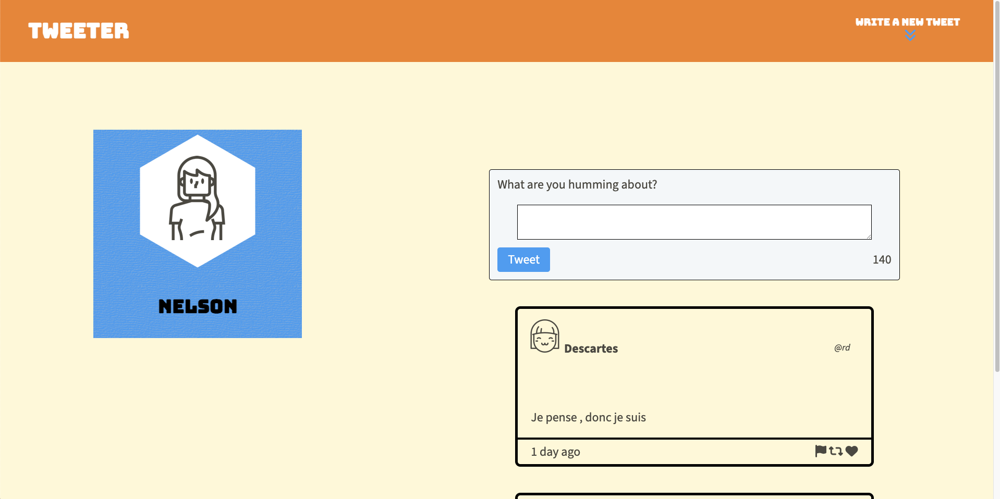
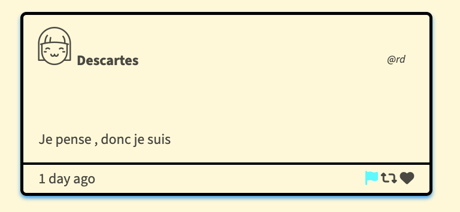

# Tweeter Project

Tweeter is a simple, single-page Twitter clone.

This repository is the starter code for the project: Students will fork and clone this repository, then build upon it to practice their HTML, CSS, JS, jQuery and AJAX front-end skills, and their Node, Express back-end skills.

## Features 

- Real-time character counter for tweets
- Dynamic tweet rendering
- Tweet composition and posting
- Error handling for empty tweets and tweets exceeding character limit

## How to use it 

- Clone the repository.
- Install dependencies by running `npm install`.
- Start the server by running `npm run local`.
- Go to http://localhost:8080/ in your browser.

##  Screenshots

